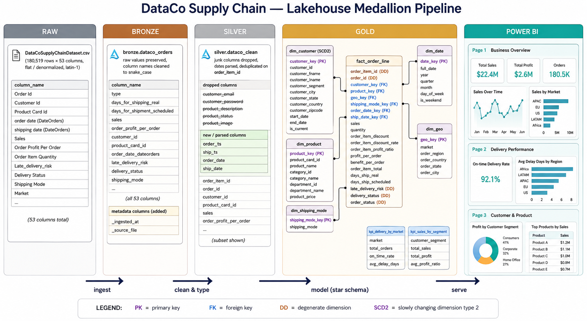
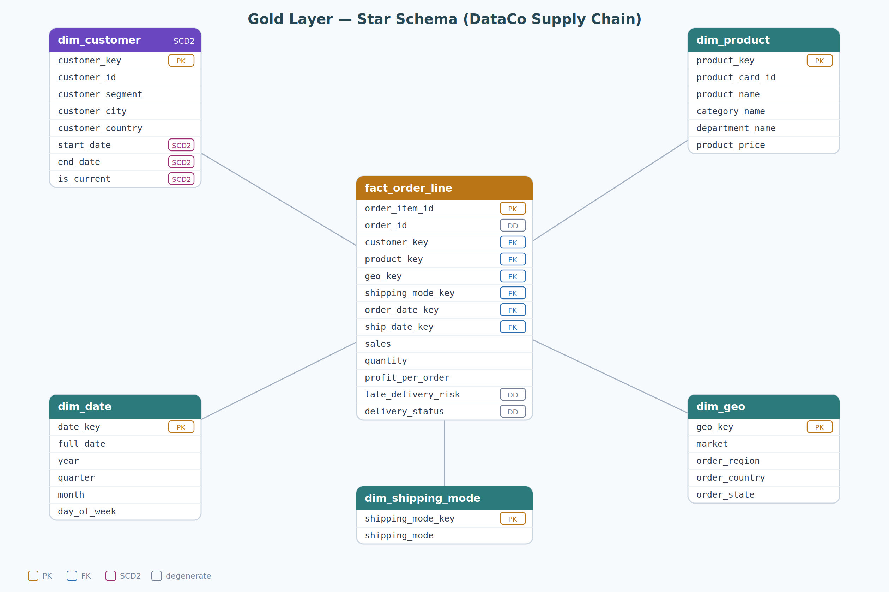
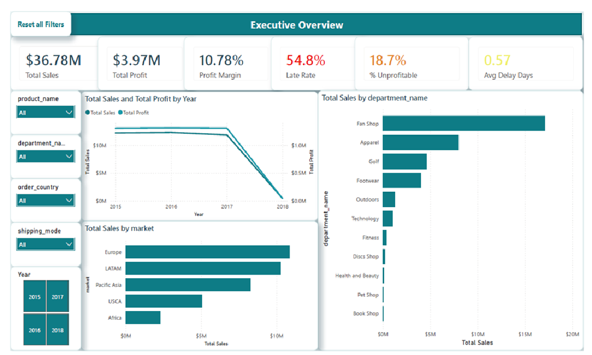
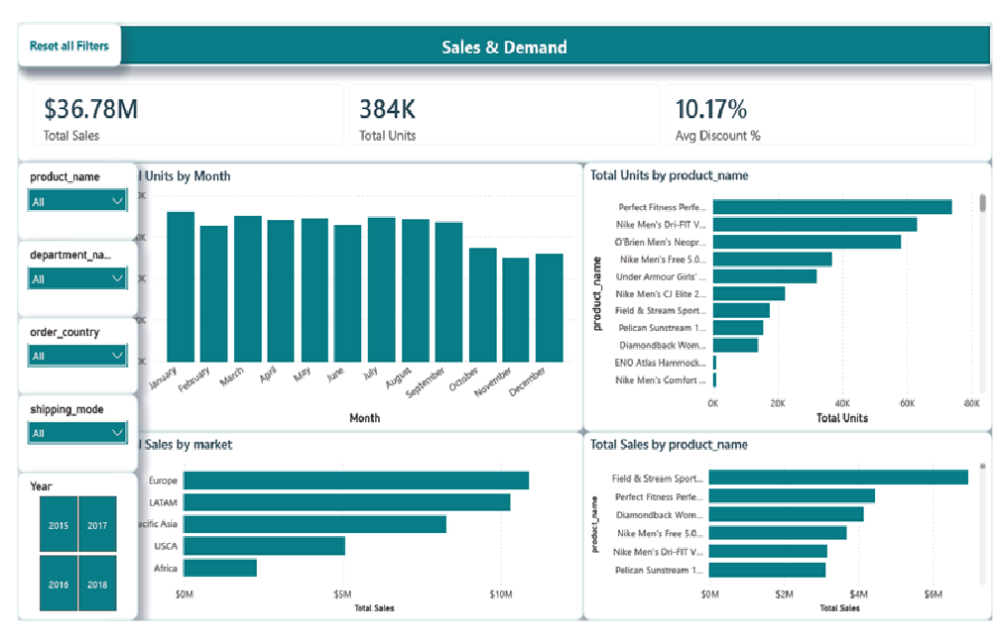
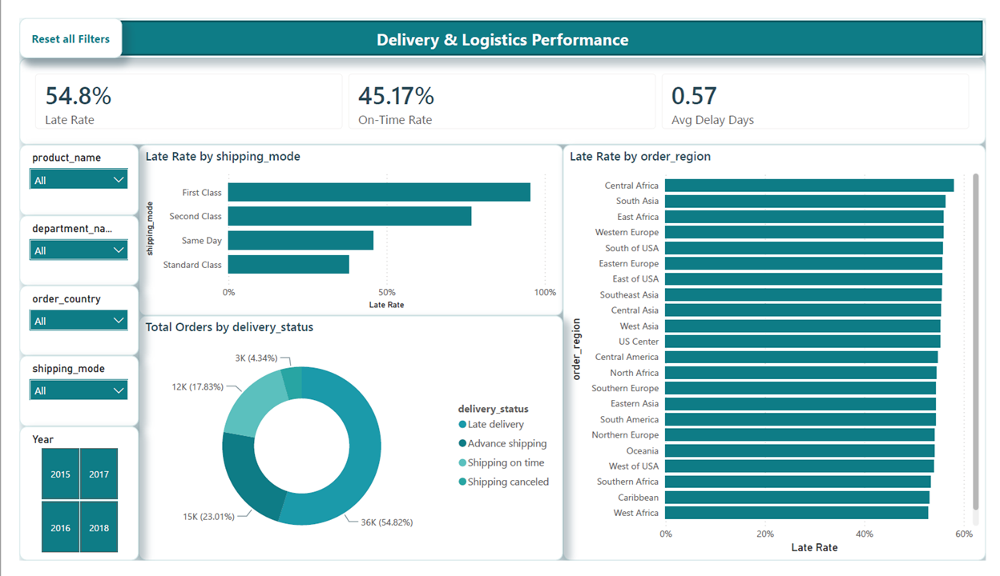
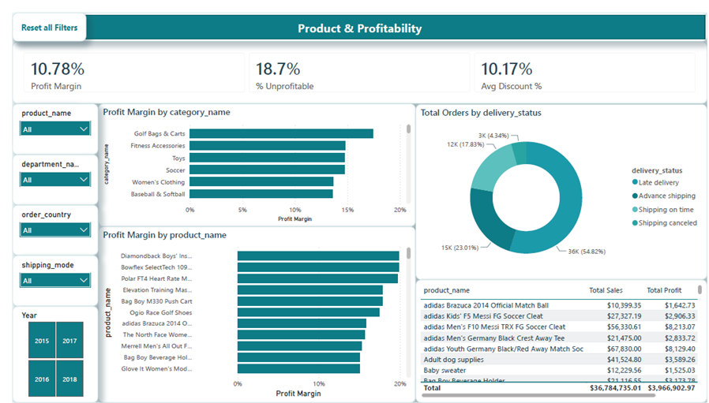
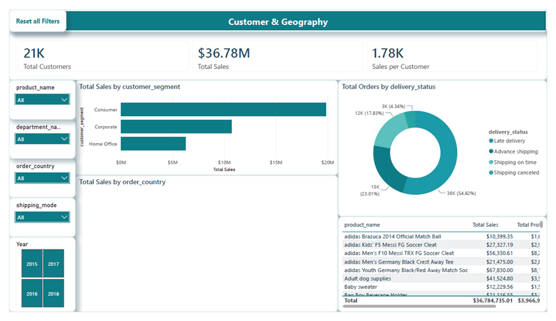

# Supply Chain Lakehouse Analytics

End-to-end **Lakehouse data engineering** project on Databricks: ingesting a raw supply-chain
dataset, modeling it into a governed **star schema** with **SCD Type 2**, and serving a
**5-page interactive Power BI dashboard** that surfaces delivery and profitability problems.

**Tech stack:** Databricks · PySpark · Delta Lake · Unity Catalog · Power BI

<!-- Optional: replace with your published Power BI link -->
> 🔗 **[View the live interactive dashboard](#)** &nbsp;|&nbsp; 📊 5 pages &nbsp;|&nbsp; 🗄️ 180K+ records

---

## 1. Overview

This project transforms the **DataCo Smart Supply Chain** dataset — a raw, flat file of
**180,519 order-line records** (65,752 orders, 2015–2018, 53 columns) covering orders,
products, customers, shipping, and delivery performance — into a clean, query-ready
analytics solution.

**Goal:** demonstrate a complete data engineering workflow — ingest messy raw data, model it
into a dimensional schema following the Medallion architecture, and deliver an executive
dashboard that turns the modeled data into decisions.

---

## 2. Architecture

The pipeline follows the **Medallion architecture** (Bronze → Silver → Gold) on Databricks
with Delta Lake and Unity Catalog, built in PySpark.



| Layer | What happens |
|-------|--------------|
| **Bronze** | Raw ingest of the source file with ingestion metadata; values preserved, column names standardized. |
| **Silver** | Cleaning, type casting, date parsing, and de-duplication to one row per order-line. |
| **Gold** | Star schema (1 fact + 5 dimensions) with **SCD Type 2** on the customer dimension and temporal joins. |

### Star schema (Gold)



The `dim_customer` dimension implements **Slowly Changing Dimension Type 2** (`start_date`,
`end_date`, `is_current`). The fact table uses a **temporal join** so each order maps to the
customer state valid at order time — preserving historical accuracy.

---

## 3. Dashboard & Key Insights

A 5-page Power BI dashboard built on the curated Gold star schema.

| # | Page | Key insight |
|---|------|-------------|
| 1 | Executive Overview | Fan Shop department drives ~**47%** of total sales |
| 2 | Sales & Demand | Top product by units (Rip Deck) ≠ top by revenue (Gun Safe) |
| 3 | Delivery Performance | **54.8%** of orders late — **95%** on First Class, not driven by geography |
| 4 | Profitability | **18.7%** of orders unprofitable; low-margin categories (Strength Training 0.6%) |
| 5 | Customer & Geography | All segments ~11% margin; revenue concentrated in few markets |

### Pages

**1. Executive Overview**


**2. Sales & Demand**


**3. Delivery Performance**


**4. Profitability**


**5. Customer & Geography**


---

## 4. Repository structure

```
supply-chain-lakehouse-medallion/
├── notebooks/
│   └── dataco_lakehouse_pipeline.py   # Databricks pipeline (Bronze → Silver → Gold)
├── diagrams/
│   ├── architecture.png               # Medallion pipeline diagram
│   └── star_schema.png                # Star schema ERD
├── dashboard/
│   ├── page_1.png ... page_5.png      # Dashboard screenshots
│   └── supply_chain.pbix              # Power BI file
├── docs/
│   └── pipeline_explained.md          # Line-by-line pipeline walkthrough
└── README.md
```

---

## 5. How to run

1. Sign up for **Databricks Free Edition** and create a workspace.
2. Upload `DataCoSupplyChainDataset.csv` to a Unity Catalog **Volume**.
3. Import `notebooks/dataco_lakehouse_pipeline.py` as a notebook.
4. Set `CATALOG` and `INPUT_PATH` in the Config cell, then run all cells top to bottom.
5. Connect Power BI (or load the exported CSVs) to the Gold tables and open `dashboard/supply_chain.pbix`.

---

## 6. Skills demonstrated

- Medallion (Bronze/Silver/Gold) lakehouse design on Databricks + Delta Lake
- Dimensional modeling: star schema, fact vs dimension, surrogate keys
- **Slowly Changing Dimension Type 2** with temporal joins
- PySpark transformations, data quality / cleaning, date handling
- KPI definition and Power BI dashboard storytelling

---

*Dataset: DataCo Smart Supply Chain (public, Kaggle). Built as a portfolio project.*
